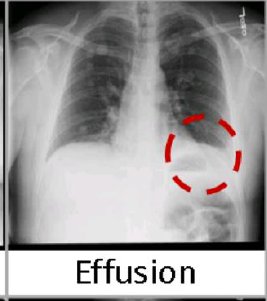
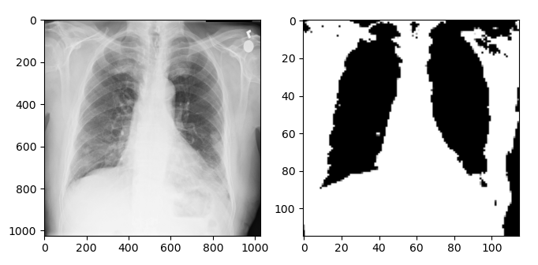
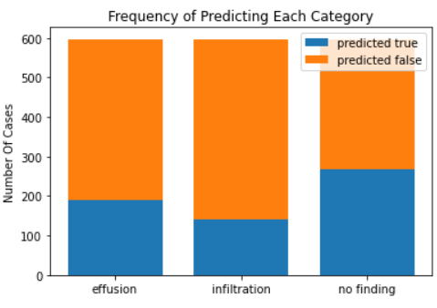
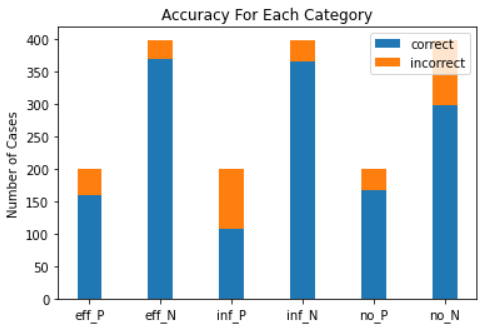
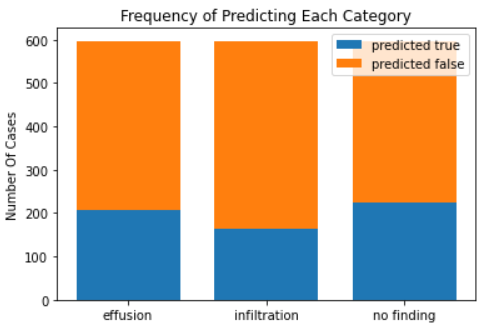
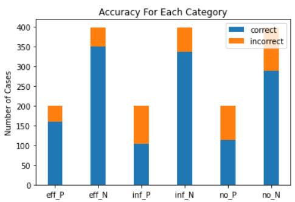

# CS-4641: X-Ray Disease Classification

## Overview
For our Spring 2020 ML project, our objective was to use X-Ray images of the human chest and determine whether a patient has no abnormalities, has signs of Infiltration or has signs of effusion. Infiltration refers to a buildup such as pus, protein, or blood in the parenchyma of the lung, while effusion refers to accumulation of fluid within the layers of the pleura in the lung.
		
## Data
We used data provided by the clinical PACS database at National Institutes of Health Clinical Center. The data provides 112,120 frontal view X-ray images of 30,805 patients. Although there are 14 different types of diseases included in the dataset, we are focusing only on Infiltration and effusion, since those are the most prevalent. Limiting the database affords us the opportunities to attempt to approach and obtain more comprehensive results. Example images with effusion and infiltration can be seen below.

	
	

## Unsupervised Learning

### Motivation
Since we were working with an image dataset, we hypothesized that we would need a fairly sophisticated model to correctly classify our images. However, we also felt inclined to try our some unsupervised methods to see if there was any way we could achieve results using unlabeled data, and to see how those results compared to other methods. Even though the afflictions we chose to focus on are well documented, it may not always be the case that a large labeled dataset will be available to train from, so we want to see if unsupervised learning can capture any general abnormalities in the x-ray images.
We chose to test out two unsupervised algorithms: K-Means and Gaussian Mixture Model (GMM). The sklearn implementation of these algorithms was used.
For each of the algorithms, several variations of the model were created in order to compare the effects of preprocessing and sampling variations.

### Data Retrieval and Formatting
Of the 112,120 images in the dataset, the images marked only as "No Finding", "Infilitration", or "Effusion" were considered; images that had multiple labels were not considered. The reduced dataset used in the unsupervised learning models consisted of 73,863 images, including 50,361 images labeled as "No Finding", 9,547 images labeled as "Infiltration", and 3,955 images labeled as "Effusion".
For all variations, the images had to be formatted before using them in the model. Each image was scaled down by a factor of 1/8, and then a margin around the edges of the images were cropped off, since we are not concerned with the edges of images. In the end, each 1024x1024 image was reformatted into a 115x115 image.

	
	
The native 1024x1024 image (left) and the reformatted 115x115 image (right)

	  	
### Training and Evaluation
Even after reducing the size of the data, there were still issues concerning memory constraints. As a result, only a small fraction of the dataset (about 2.5%) was sampled and used to train each model.
After training the model, all 73,863 images were clustered using the classifier. For evaluation, the Silhouette Coefficient and the Davies-Bouldin Index each model's clustering was calculated. Due to the aforementioned memory constraints, these values were calculated using a subset of the full dataset.

### Variation #1: PCA
For this variation, the model was trained on feature-reduced data using Principal Component Analysis. Each 115x115 image consisted of 13,225 features, and PCA determined that 99% of the variance of the training population could be captured in ~500 features.
In addition to PCA, the formatting, training, and evaluation techniques described previously were used in this variation.

	

		
		
Silhouette Coefficient: -0.04659465092815443

		
Davies-Bouldin Index: 19.193659061323928

	

	

		
		
Silhouette Coefficient: -0.0657013023269497

		
Davies-Bouldin Index: 17.129075319442464

	

Visually, the clusters did not do a very good job of encoding any one label in particular: each cluster contains some number of each of the three labels. The Silhouette Coefficient and Davies-Bouldin Index for both K-Means and GMM also indicate that the clusterings are not very good. Originally, this variation of the models was intended to be the only one, but after seeing how poorly the classifiers performed, we decided to try other techniques to try and obtain better results.

### Variation #2: PCA with Image Sharpening
Initially, it was thought that the issue could have been with the reduction in resolution that came with reformatting the images to a smaller size. To remedy this, we tried sharpening each image before performing the rescaling operation and PCA reduction.

	
	
The native 1024x1024 image (left) and the reformatted, sharpened 115x115 image (right)

In addition to the image sharpening and PCA, the formatting, training, and evaluation techniques described previously were used in this variation.

	

		
		
Silhouette Coefficient: -0.0295680506519903

		
Davies-Bouldin Index: 15.419093994434792

	

	

		
		
Silhouette Coefficient: -0.1372546706651214

		
Davies-Bouldin Index: 7.588603363206704

	

Sharpening the images did not produce the desired improvement for either algorithm.

### Variation #3: PCA with Gaussian filtering and labeling
For this variation, we tried an opposite approach to that of variation #2: instead of sharpening the image, we tried blurring the image using a Gaussian filter, then labeling each pixel as either "light" or "dark" to create a two-tone representation of each image.

	
	
The native 1024x1024 image (left) and the reformatted, two-tone 115x115 image (right)

In addition to the Gaussian filtering and PCA, the formatting, training, and evaluation techniques described previously were used in this variation. Image sharpening was not used.

	

		
		
Silhouette Coefficient: -0.020005451318199686

		
Davies-Bouldin Index: 26.989964416324856

	

	

		
		
Silhouette Coefficient: -0.09146024643428696

		
Davies-Bouldin Index: 12.810858631261144

	

Again, using this method of preprocessing did not improve the results.

### Variation #4: Revised sampling

Next, we considered that perhaps our method of sampling may have been producing the undesirable results observed in the other variations. Only 2.5% of the total population is being used to train our classifiers, and since the dataset is made up mostly of "No Finding" images, we considered the possibility that the training data set was being dominated by those images and thus not adequetely encoding the perturbations shown in "Infiltration" and "Effusion" images. To try and rectify this, we changed our sampling method to include equal represention for all three labels in the training data.
In addition to the PCA, the formatting, training, and evaluation techniques described previously were used in this variation. Image sharpening and the Gaussian filtering were not used.

	

		
		
Silhouette Coefficient: -0.04532959360468642

		
Davies-Bouldin Index: 17.516901366607243

	

	

		
		
Silhouette Coefficient: -0.036171845647132814

		
Davies-Bouldin Index: 26.830940296727633

	

Unfortunately, revising the sampling method was not sufficient to create adequete clusters.

### Variation #5: PA Reduced Dataset
For the last two variations, we reduced our dataset to only include images in PA view. Our dataset contains x-ray images in two different views: PA and AP. The two views look different, which may have affected the results of the previous variations. Thus, the dataset was reduced to 46,658 images, including 39,302 labeled as "No Finding", 5,270 labeled as "Infiltration", and 2,086 labeled as "Effusion".
Additionally, PCA was used in this variation. Image sharpening, Gaussian filtering, and even sampling were not used.

	

		
		
Silhouette Coefficient: -0.08958933277876549

		
Davies-Bouldin Index: 19.922589621643844

	

	

		
		
Silhouette Coefficient: -0.14684648218703802

		
Davies-Bouldin Index: 17.8765158264399

	

Using the PA dataset did not improve the clustering.

### Variation #6: PA Reduced Dataset w/ Normalization
Lastly, we tried normalizing the PA reduced dataset, in addition to PCA.
Image sharpening and the Gaussian filtering were not used.

	

		
		
Silhouette Coefficient: -0.13722082581983966

		
Davies-Bouldin Index: 21.271228511790337

	

	

		
		
Silhouette Coefficient: -0.12399242074630179

		
Davies-Bouldin Index: 16.551696618323597

	

Normalization did not improve the clustering.

### Unsupervised Learning: Conclusions
In the end, we were unable to produce create clusters that sufficiently categorized our data. There are several possible reasons we thought of as to why this was the case:
<ul>
<li>More sophisticated preprocessing methods may have been necessary, including combining some of the methods we tried</li>
<li>The parameters used in image sharpening, Gaussian Filtering, image labeling, PCA, and the K-Means/GMM models may have needed further refinement</li>
<li>Our use of sampling methods in order to work around the encountered memory limitations</li>
<li>K-Means and GMM may just not be powerful enough to encode the patterns we were looking for</li>
</ul>
Overall, even though the results are not what we wanted, the process behind implementing these unsupervised algorithms taught us a lot about the potential difficulties of machine learning in general. When the model doesn't produce the desired results, it can often be difficult to pinpoint exactly where the problem lies: whether it be in the dataset itself, how you processed that dataset, or in your choice of model and parameters. Even if training your model only takes a couple of lines long, there is so much computation that goes on goes on behind the scenes that you should carefully consider the size and contents of your data before attempting it. If we were to attempt these unsupervised algorithms again, we would invest more time in formatting and preprocessing the data to try and maximize the encoded information in as small a format as possible.
		
## Supervised Learning with Neural Networks

### Motivation
Convolutional neural networks are very commonly used in image categorization, and since we did not know what to expect with our unsupervised learning results, we decided to create a conventional CNN that would be able to categorize chest x-ray images as no finding, infiltration, or effusion, the same labels used in the unsupervised learning section, since this method reliably gets good results. Additionally, we wished to create a densely connected convolutional network, a CNN variant in which each layer is connnected to all other layers, for the same purpose to see if we can achieve higher classification accuracy.

### Preprocessing
Before training the networks on the images, the images were normalized by subtracting the mean of each channel from each pixel in a color channel, and then dividing the result by the standard deviation of the channel. To mitigate overfitting, images were cropped and/or mirrored randomly, and resulting images were downsampled to 224x224 so that the networks could be fitted in a reasonable amount of time.

	  		

The four images above are all of the same image after preprocessing. All have been randomly cropped, and the top right one has been reversed along the Y axis.

**Two-Category Test**

To check that we were building our networks correctly and if the approach was feasible, we created a conventional CNN and a densenet that would classify images belonging only to the infiltration and effusion categories. The conventional CNN had a training accuracy of 0.8683 and a validation accuracy of 0.7727, and the densenet had a training accuracy of 0.9802 and a validation accuracy of 0.9040. We expected that the densenet would similarly outperform the conventional CNN on the three category classifier.

### Conventional CNN Model
In our CNN implementation, we used the Sequential class in the TensorFlow Keras library. The created model consisted of three sets of convolutional, batch normalization, leaky regularization, and max pooling layers, and a flattening layer and three dense layers were used to convert the features into an output label value. The model had a total of 931,329 parameters, 930,443 of which were trainable.

	  		

To train the network, we randomly selected 2000 posterior-anterior images from each label category as the training data, and selected 199 images from each dataset as the testing data. Since the effusion set had less than 2200 items, some images were selected more than once, and the prepocessing step made them look different.

**Results**

The network was trained for 250 epochs, and achieved an accuracy of 0.8416 on the training data and 0.7152 on the validation set. The difference is indicative of overfitting and validation accuracy did not significantly increase after the 150th epoch, but results were still significantly better than chance.

	  		

| Category | True Positive | True Negative | False Positive | False Negative | Precision | Recall |
| ----------- | ----------- | ----------- | ----------- | ----------- | ----------- | ----------- |
| No Finding | 167 | 298 | 100 | 32 | 0.6255 | 0.8392 |
| Effusion | 160 | 369 | 29 | 39 | 0.8466 | 0.8040 |
| Infiltration | 108 | 365 | 33 | 91 | 0.7660 | 0.5427 |

	  		

	  		

### Densely Connected Convolutional Network Model
As with the conventional CNN, we used a class located in the TensorFlow Keras package for our densenet implementation. In short, a densenet is a variation of a convolutional neural network in which the outputs of a layer are concatenated to the input of all layers below it, essentially connecting it to all lower layers. Densenets have been implemented to have lower error rates on common data sets, and we wanted to see if we could get better results than a conventional CNN with one.

**Results**

The same dataset was used to train the densenet. The densenet took twice as long to train for each epoch than the conventional network, so only 100 epochs were done before training was terminated, and validation accuracy was no longer increasing at the time of termination.

Contrary to our expectations, the densenet did not have a higher validation accuracy than the conventional network on our training set. The densenet achieved 0.9518 training set accuracy and 0.6717 validation set accuracy, which indicates that the densenet suffered more from overfitting than did the conventional CNN, although both neural nets produced results that were significantly better than chance. Precision and recall values for each category were lower than the corresponding ones from the conventional CNN, indicating that we created a worse classifier in general with this method. 

| Category | True Positive | True Negative | False Positive | False Negative| Precision | Recall |
| ----------- | ----------- | ----------- | ----------- | ----------- |----------- |----------- |
| No Finding | 114 | 288 | 110 | 85 | 0.5098 | 0.5279 |
| Effusion | 159 | 349 | 49 | 40 | 0.7644 | 0.7990 |
| Infiltration | 103 | 336 | 62 | 96 | 0.6242 | 0.5176 |

	  		

	  		

### Supervised Learning Conclusions
In the supervised learning datasets, we excluded all anterior-posterior images because they were visually different, and we believed including both views would negatively impact results. Doing so restricted the size of the training data, and may have had a larger negative impact on training results than having two different image view types. Both methods suffered from overfitting, which was much more apparent on the densenet. However, results were still significantly better than chance for both neural network methods. We believe that with a larger dataset, the densenet would have been able to acheive better validation accuracy, but training such a network would have required significantly more time and resources than we could reasonably expend.

One thing in common with both approaches is that both networks had the lowest recall for the infiltration category. This may be due to the relative lack of distinct features of this condition, and conditions that were not included in the dataset may have had a higher true positive rate had they been used and labeled in the training set. Conversely, both networks had high F1 coefficients for effusion.

## Individual Responsibilities
<ul>
		  <li>Overview and Data: Eithan Martinez</li>
		  <li>Unsupervised Learning: Armand Marino</li>
	<li>Supervised Learning: Yihe Liu</li>
	<li>NN Data and Analysis: Richard Li</li>
		</ul>
